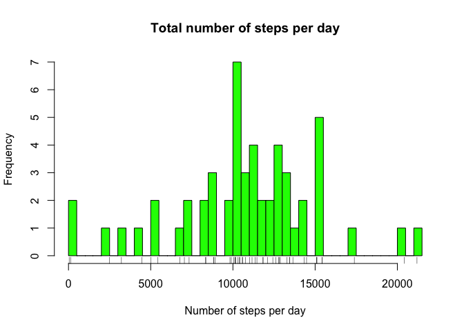
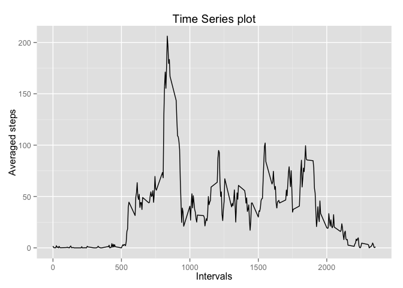
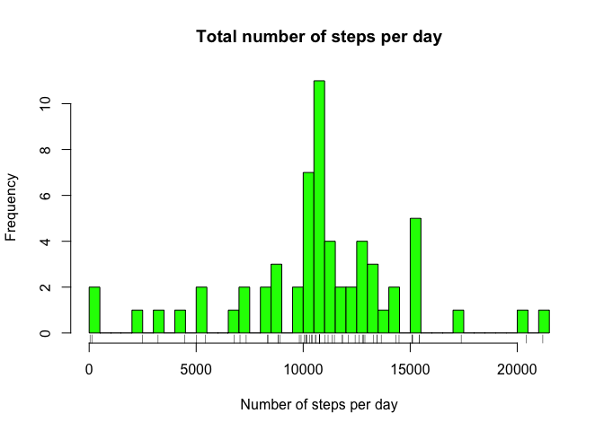
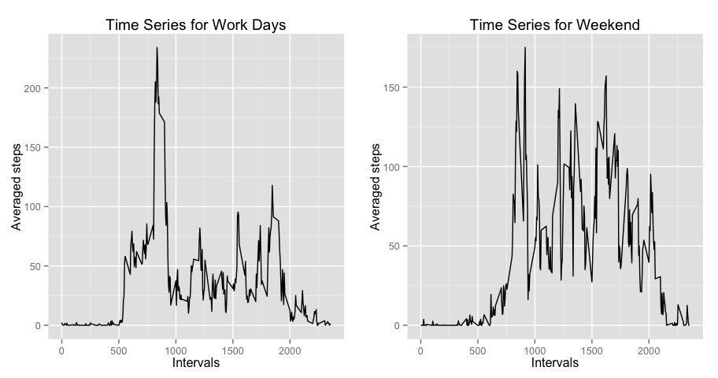

# Reproducible Research: Peer Assessment 1

Analysis of daily steps
=======================

It is now possible to collect a large amount of data about personal movement using activity monitoring devices such as a Fitbit, Nike Fuelband, or Jawbone Up. These type of devices are part of the “quantified self” movement – a group of enthusiasts who take measurements about themselves regularly to improve their health, to find patterns in their behavior, or because they are tech geeks. But these data remain under-utilized both because the raw data are hard to obtain and there is a lack of statistical methods and software for processing and interpreting the data.

This assignment makes use of data from a personal activity monitoring device. This device collects data at 5 minute intervals through out the day. The data consists of two months of data from an anonymous individual collected during the months of October and November, 2012 and include the number of steps taken in 5 minute intervals each day.

## Loading and preprocessing the data##

The variables included in this dataset are:

- steps: Number of steps taking in a 5-minute interval (missing values are coded as NA)
- date: The date on which the measurement was taken in YYYY-MM-DD format
- interval: Identifier for the 5-minute interval in which measurement was taken

The dataset is stored in a comma-separated-value (CSV) file and there are a total of 17,568 observations in this dataset.

The procedure used for loading data is:


```r
data=read.csv("activity.csv")
```

The procedure used for removing NA values from the data is:


```r
good=complete.cases(data)
steps<-data$steps[good]
date<-data$date[good]
interval<-data$interval[good]
dataComplete=data.frame(steps,date,interval)
```


## What is mean total number of steps taken per day?##

The missing values were ignored. 

The total number of steps taken each day is calculated using:


```r
stepsTotal<-aggregate(steps~date, dataComplete, sum)
```

which gives us following histogram:


```r
hist(stepsTotal$steps, col="green", breaks=50, main="Total number of steps per day",xlab="Number of steps per day", ylab="Frequency")
rug(stepsTotal$steps)
```

 

The mean and median total number of steps were calculated using the following procedures:


```r
stepsMean<-aggregate(steps~date,dataComplete,mean)
stepsMedian<-aggregate(steps~date,dataComplete,median)

generalMean<-mean(stepsMean$steps,na.rm=TRUE)
generalMedian<-median(stepsMedian$steps,na.rm=TRUE)
```

And give the following results:
Mean of total number of steps: 37.3825996.
Median of total number of steps: 0.


## What is the average daily activity pattern?##

An average daily activity pattern was calculated with following procedure:


```r
stepsInterval<-aggregate(steps~interval,dataComplete,mean)
```

And time series plot of the pattern is:

 

NOTE: For correct display of the previous plot, one needs to install ggplot2 package. 


Determining which 5-minute interval, on average across all the days in the dataset, contains the maximum number of steps required additional processing of the data presented in following code snippet:


```r
dateUnique<-unique(date)
intervalUnique<-unique(interval)
stepsAverage<-numeric(length(intervalUnique))
intervalAverage<-data.frame(intervalUnique,stepsAverage)
for (i in dateUnique){
      dataSub<-subset(dataComplete,date==i)
      stepsAverageInterval<-aggregate(steps~interval,dataSub,mean)
      intervalAverage$stepsAverage=intervalAverage$stepsAverage+
                  stepsAverageInterval$steps/length(dateUnique)
}

maxSteps<-intervalAverage$intervalUnique[which.max(intervalAverage$stepsAverage)]
```

The interval 835 is the one that contains maximum number of steps. The intervals in the dataset correspond to the time in the day expressed in 24 hours format. 

Thus, observed persons tend to make the maximum number of steps around 8:35 AM. 


## Imputing missing values##

The additional analysis was preformed to determine possible influence of the missing values. 
The total number of missing values in the data set was obtained with:

```r
numberRowsNA<-length(data$steps)-sum(good)
```
and it's value is: 2304.

The missing values were exchanged with the average values for the corresponding interval using following code:


```r
ind<-which(is.na(data$steps))
dataNoNA<-data

for (i in ind){
      inter<-data$interval[i]
      stepIndex<-which(intervalAverage$intervalUnique==inter)
      stepAve<-intervalAverage$stepsAverage[stepIndex]
      dataNoNA$steps[i]=stepAve
}
```
After which the calculations for the mean total number of steps taken per day were repeated on this newly formed dataset.
The resulting histogram is:

 

And results for mean and medium for the new data set are:


- Mean for corrected data set: 37.3825996
- Median for corrected data set: 0

For the comparison previously calculated results are: 
- Mean: 37.3825996.
- Median: 0.


Thus, the conclusion is that missing data does not introduces the bias and can be safely ignored. 

## Are there differences in activity patterns between weekdays and weekends?##

In general, human activity varies between week-days and week-end. Thus analysis was done to establish is that the case with the monitored activity. 
To preform this analysis a new variable needed to be added, the variable that distinguishes the week-days and weekends. This was accomplished with:


```r
weekday<-weekdays(as.Date(dataComplete$date))
weekdayLogic<-(weekday=="Saturday") | (weekday=="Sunday")
dataComplete$weekend<-as.numeric(weekdayLogic)
```

The calculations for the average daily activity pattern were performed separately for weekdays and weekends.


```r
dataWorkday<-subset(dataComplete,weekend==0)
dataWeekend<-subset(dataComplete,weekend==1)

stepsIntervalWorkday<-aggregate(steps~interval,dataWorkday,mean)
stepsIntervalWeekend<-aggregate(steps~interval,dataWeekend,mean)
```

Results are presented in following graph:

```
## Loading required package: gridExtra
## Loading required package: grid
```

 

NOTE: For correct display of previous plot, one needs to install gridExtra package. 

The results show noticeable difference in the activity pattern between the weekdays and weekend. This results indicate that the observed person is fully employed, most likely doing sedentary job, and tends to spend leisure time on their feet. 
As such, this person can be targeted for outdoor product advertising.


